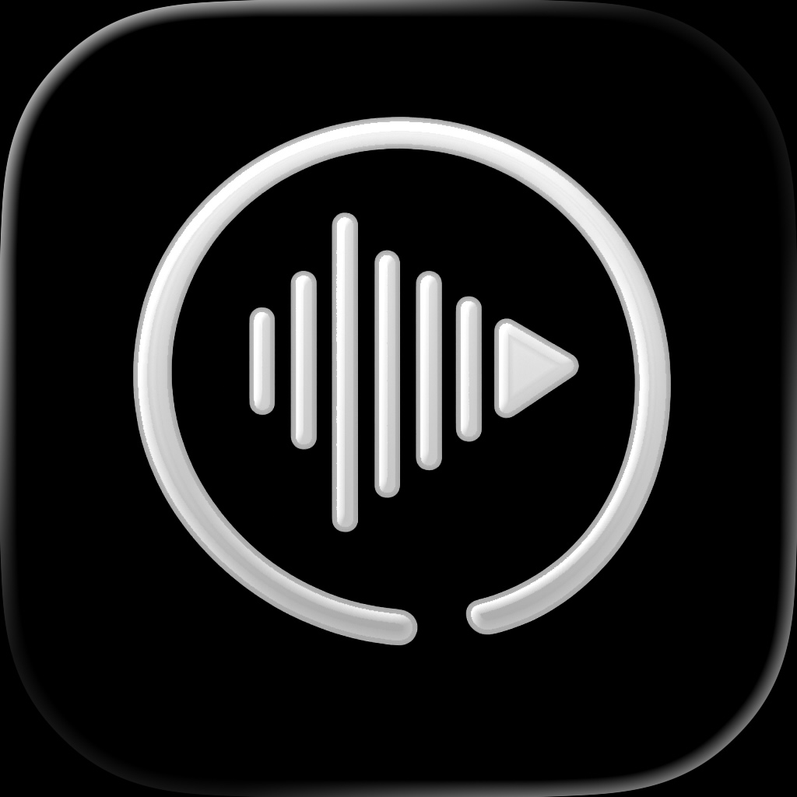
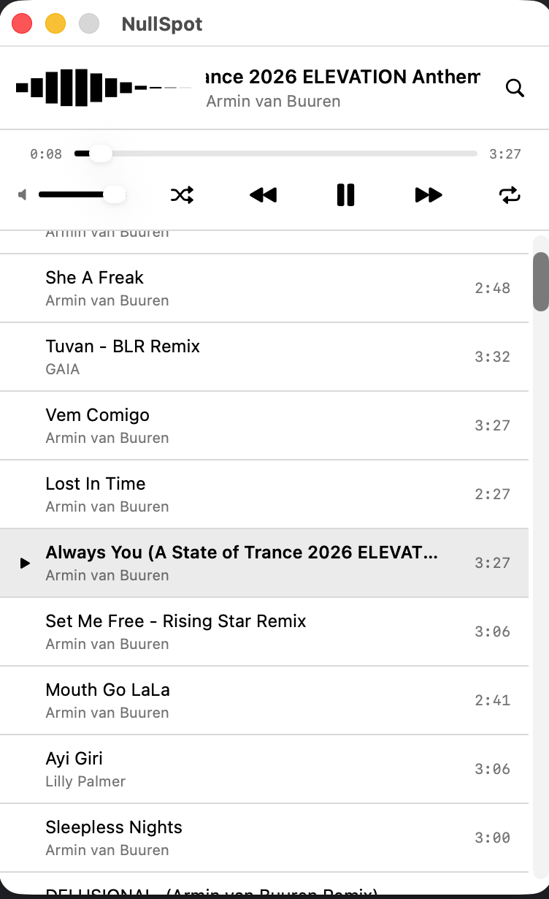

<p align="center">
  
</p>

<h1 align="center">NullSpot</h1>

<p align="center"><strong>A lightweight macOS Spotify player inspired by the classic Winamp.</strong></p>

<p align="center">
  Native audio, a real-time visualizer, and a tiny footprint — no Electron, no 1 GB of RAM.<br />
  Simple setup: just log in and play.
</p>

<p align="center">
  <a href="https://github.com/michaelh03/NullSpot/releases/latest"><strong>Download</strong></a>
</p>

<p align="center">
  
</p>

> [!NOTE]
> NullSpot is an unofficial client and is not affiliated with or endorsed by Spotify. A **Spotify Premium** account is required.

## Why NullSpot?

NullSpot streams audio itself through a native engine ([librespot](https://github.com/librespot-org/librespot)) wrapped in a small SwiftUI app — so it stays out of your way and off your fans.

| | Spotify (official) | NullSpot |
|---|---|---|
| CPU during playback | ~20% *(ballpark)* | ~5% |
| Memory | ~1 GB *(ballpark)* | ~80 MB |
| UI | Electron | Native SwiftUI |
| Footprint | Full desktop app | Winamp-style mini player |

<sub>NullSpot figures measured on Apple Silicon during steady-state playback (Release build). Official-Spotify figures are rough, observed estimates. Your numbers will vary.</sub>

## Features

- **Winamp-style mini player** — a compact, focused window that gets out of your way
- **Native audio playback** — streams directly via librespot (no browser, no Web Playback SDK)
- **Real-time visualizer** — FFT-driven spectrum bars that react to what's playing
- **Marquee track display** — scrolling now-playing title and artist
- **Spotify Connect & AirPlay** — play to other devices or route audio to AirPlay speakers
- **Search everything** — songs, artists, albums, playlists, and podcasts
- **Persistent queue** — your queue is restored when you reopen the app
- **Podcast resume** — picks up episodes where you left off
- **Favorites** — like/unlike tracks, synced with your Spotify library
- **Volume control** — built right into the player

## Requirements

- macOS 15.0 or later
- A Spotify **Premium** account

## Installation

### Homebrew

```bash
brew install --cask michaelh03/nullspot/nullspot
```

### Direct download

1. Download the [latest release](https://github.com/michaelh03/NullSpot/releases/latest)
2. Unzip it and move `NullSpot.app` to your **Applications** folder
3. Launch NullSpot

## Getting started

1. Open NullSpot
2. Click **Connect with Spotify**
3. Authorize NullSpot in the browser window that opens — that's it

No Client ID, no developer dashboard, no configuration. NullSpot ships with a built-in,
production-approved Spotify application ID, so authentication works out of the box. Your
login is stored securely in the macOS Keychain.

## Keyboard shortcuts

### Playback

| Shortcut | Action |
|----------|--------|
| `Space` | Play / Pause |
| `⌘ →` | Next track |
| `⌘ ←` | Previous track |

### Search

| Shortcut | Action |
|----------|--------|
| `⌘ F` / `⌘ K` | Toggle search |
| `⌘ 1` | Songs |
| `⌘ 2` | Artists |
| `⌘ 3` | Albums |
| `⌘ 4` | Playlists |
| `⌘ 5` | Podcasts |

## How it works

NullSpot is a SwiftUI app that talks to a Rust core via a C FFI bridge. The Rust layer uses
[librespot](https://github.com/librespot-org/librespot) for authentication and native audio
streaming; the Swift layer handles the UI, the Spotify Web API, and audio rendering
(including AirPlay) through `AVAudioEngine`.

See [DEVELOPMENT.md](DEVELOPMENT.md) for build instructions and a deeper architecture overview.

## Building from source

You'll need Xcode 26.2+ and the [Rust toolchain](https://rustup.rs/).

```bash
# 1. Build the Rust core
cd rust && ./build.sh && cd ..

# 2. Build the app (or open NullSpot.xcodeproj in Xcode)
xcodebuild -scheme NullSpot -destination 'platform=macOS' build
```

Full details are in [DEVELOPMENT.md](DEVELOPMENT.md).

## Contributing

Contributions are welcome — see [CONTRIBUTING.md](CONTRIBUTING.md).

## Acknowledgments

- Based on [Spotifly](https://github.com/ralph/Spotifly) by **Ralph von der Heyden** — the original project this was forked from.
- Built on [librespot](https://github.com/librespot-org/librespot), and uses the same
  production Spotify application ID published by [ncspot](https://github.com/hrkfdn/ncspot).

## License

Released under the MIT License — see [LICENSE](LICENSE) for details.
